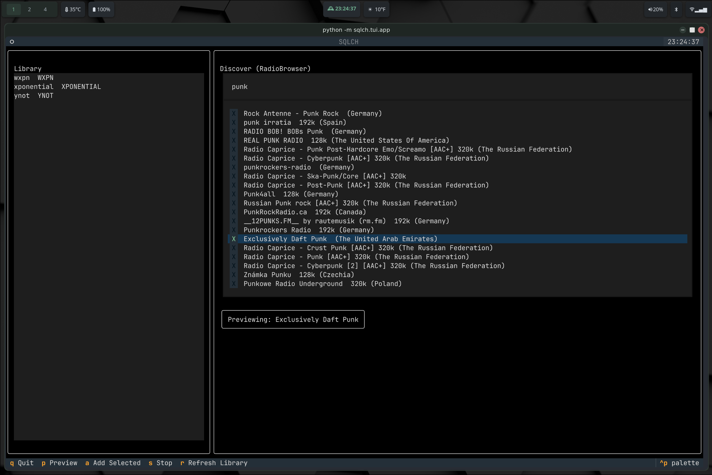

# sqlch

**sqlch** is a headless radio and streaming control toolkit with a clean
CLI, a growing TUI, and a strong bias toward reproducibility.

It's designed to sit comfortably in Unix pipelines, window manager
setups, and declarative systems (especially NixOS), while remaining
usable as a standalone Python application.

This project is also an experiment in *human--machine co-development*:
using an LLM as a systems-level collaborator, not a code vending
machine.

------------------------------------------------------------------------

## TUI Preview



Textual-based TUI for discovery and preview, backed by the same core used by the CLI.

------------------------------------------------------------------------

## What sqlch is

-   A **CLI-first** radio / stream orchestrator
-   A **Python application**, not a monolith
-   A **reproducible artifact** (builds cleanly via PEP 517 and Nix)
-   A place where **metadata, playback, and control** are treated as
    separate concerns

------------------------------------------------------------------------

## What sqlch is *not*

-   Not a GUI-first media player
-   Not a Spotify clone
-   Not a "just works on my machine" script bundle
-   Not dependent on global Python state

------------------------------------------------------------------------

## Architecture (high level)

    sqlch/
    ├── cli/        # Argument parsing, commands, UX surface
    ├── core/       # Playback, discovery, library, metadata
    ├── tui/        # Textual-based interface (optional layer)
    └── tools/      # Repo hygiene, linting, sanity checks

Key principles:

-   **One import root** (`sqlch.*`)
-   **Explicit boundaries** between CLI, core logic, and UI
-   **No hidden globals**
-   **No implicit environment assumptions**

------------------------------------------------------------------------

## Installation

### NixOS (recommended)

`sqlch` is designed to be built as a proper Nix package, producing a
wrapped executable with isolated dependencies and no pollution of system
Python.

### Python (development / venv)

``` bash
git clone https://github.com/SW-philip/sqlch
cd sqlch
python -m venv .venv
source .venv/bin/activate
pip install -e .
```

------------------------------------------------------------------------

## Usage

``` bash
sqlch play <id|name|index|url>
sqlch status
sqlch pause
sqlch stop
```

Library management:

``` bash
sqlch list
sqlch info <id>
sqlch add <url>
sqlch edit <id>
sqlch rm <id>
```

Discovery:

``` bash
sqlch search <query>
sqlch preview <index|url>
sqlch import <stations.json>
```

------------------------------------------------------------------------

### On AI-assisted development

An LLM was used extensively throughout this project---not as an
autopilot, but as a collaborator that refuses to share local context.

The value wasn't speed. It was pressure.

The software here isn't AI-authored; it's software that survived
sustained questioning.

If this project is useful, it's not because it solves a large problem.
It's because it documents what happens when someone starts with a UX
instinct, refuses inherited constraints, and learns the system by
pushing directly on its weakest assumptions.
