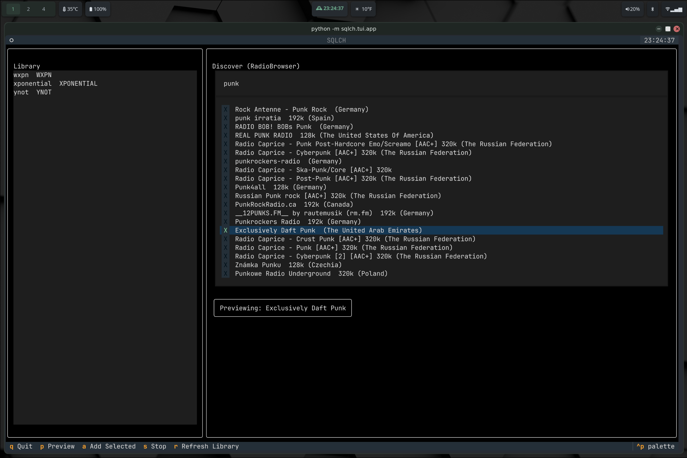

# sqlch

**sqlch** is a headless internet radio and stream control toolkit with a
CLI, a Textual TUI, and MPRIS2 D-Bus integration. It is designed to sit
comfortably in Unix pipelines, window manager setups, and declarative
systems (especially NixOS), while remaining usable as a standalone
Python application.

---

## TUI Preview



---

## What sqlch is

- A **CLI-first** radio orchestrator — status, play, pause, stop, search, preview
- A **daemon + IPC** architecture — a long-running process handles playback; the CLI talks to it over a Unix socket
- A **local station library** — stations are saved, tagged, and tracked with play history
- An **MPRIS2 player** — integrates with desktop environments via D-Bus (playerctl, waybar, etc.)
- A **metadata enricher** — ICY stream titles are enriched via Spotify and MusicBrainz in the background
- A **Nix-first artifact** — builds cleanly as a flake; the MPRIS plugin path and mpv binary are injected at build time

---

## What sqlch is not

- Not a GUI media player
- Not a Spotify client
- Not dependent on global Python state or system packages

---

## Architecture

```
sqlch/
├── cli/        # Argument parsing and command dispatch
├── core/       # Playback, IPC, library, enrichment, discovery
│   ├── player.py       # mpv lifecycle, IPC helpers, metadata watcher
│   ├── daemon.py       # Unix socket server, command handler
│   ├── client.py       # Client side of daemon IPC
│   ├── library.py      # Station CRUD, play tracking
│   ├── mpris_daemon.py # MPRIS2 D-Bus publisher
│   ├── enrich.py       # MusicBrainz enrichment + cache
│   ├── spoti.py        # Spotify enrichment + cache
│   ├── discover.py     # RadioBrowser search
│   └── notify.py       # Desktop notifications
└── tui/        # Textual-based interface (optional)
```

Key design decisions:

- All MPV communication uses the JSON IPC protocol over a raw Unix socket — no socat, no subprocess pipes
- The MPRIS plugin is optional at runtime; `preview()` works without it
- Enrichment is cached with a 30-day TTL (both Spotify and MusicBrainz)
- Station library is a plain JSON file; plays are recorded with timestamps

---

## Installation

### Nix (recommended)

sqlch is packaged as a Nix flake. The Nix build wraps the executable
with isolated dependencies and injects the MPRIS plugin path and mpv
binary — no system Python required.

**Run directly from GitHub (no clone required):**

```bash
nix run github:SW-philip/sqlch
```

**From a local checkout:**

```bash
git clone https://github.com/SW-philip/sqlch
cd sqlch
nix build
./result/bin/sqlch --help
```

**As a flake input:**

```nix
inputs.sqlch.url = "github:SW-philip/sqlch";

environment.systemPackages = [
  inputs.sqlch.packages.x86_64-linux.default
];
```

### Python (development / virtualenv)

```bash
git clone https://github.com/SW-philip/sqlch
cd sqlch
python -m venv .venv
source .venv/bin/activate
pip install -e .
```

Outside of Nix, `SQLCH_MPRIS_PLUGIN` and `MPV_BIN` must be set
manually if MPRIS integration or a non-default mpv binary is needed.
Playback and the CLI work without them.

---

## Usage

### Daemon

sqlch uses a background daemon for persistent playback state. Start it
once (or manage it with your init system):

```bash
sqlch daemon
```

The CLI talks to the daemon automatically if it's running, and falls
back to direct playback if not.

### Playback

```bash
sqlch play <id|name|index|url>   # play a station by id, name, search index, or URL
sqlch play-last                  # resume the most recently played station
sqlch pause                      # toggle pause
sqlch stop                       # stop playback
sqlch status                     # show current track and station
```

### Library

```bash
sqlch list                       # list saved stations
sqlch info <id>                  # show station details
sqlch add <url>                  # add a station by URL
sqlch edit <id>                  # edit station metadata in $EDITOR
sqlch rm <id>                    # remove a station
```

### Discovery

```bash
sqlch search <query>             # search RadioBrowser, shows numbered results
sqlch play <index>               # play result by number from last search
sqlch preview <index|url>        # preview for 10s (ducks main volume if playing)
```

### TUI

```bash
sqlch tui
```

The TUI provides search, selection, preview, and playback backed by the
same core as the CLI.

---

## MPRIS2 / Desktop Integration

When built with Nix, sqlch registers as `org.mpris.MediaPlayer2.sqlch`
on the session D-Bus:

```bash
playerctl --player=sqlch status
playerctl --player=sqlch metadata
```

Waybar and similar compositors can poll it directly. Volume changes via
D-Bus are forwarded to mpv in real time.

---

## Metadata Enrichment

When a new ICY stream title is detected, sqlch attempts enrichment in
this order:

1. **Spotify** — canonical artist name, album, year, genre, album art
2. **MusicBrainz** — album, year, genre tags (fallback)

Results are cached for 30 days. Set credentials to enable Spotify:

```bash
export SPOTIFY_CLIENT_ID=...
export SPOTIFY_CLIENT_SECRET=...
```

MusicBrainz enrichment requires no credentials.

---

## Environment Variables

| Variable | Default | Purpose |
|---|---|---|
| `MPV_BIN` | `mpv` | Path to mpv binary |
| `SQLCH_MPRIS_PLUGIN` | *(unset)* | Path to MPRIS Lua script (injected by Nix) |
| `SPOTIFY_CLIENT_ID` | *(unset)* | Spotify API client ID |
| `SPOTIFY_CLIENT_SECRET` | *(unset)* | Spotify API client secret |
| `SQLCH_SPOTIFY_BASE` | Spotify API | Override Spotify API base URL |
| `SQLCH_MUSICBRAINZ_BASE` | MusicBrainz API | Override MusicBrainz API base URL |
| `SQLCH_RADIOBROWSER_BASE` | RadioBrowser API | Override RadioBrowser API base URL |
| `XDG_CACHE_HOME` | `~/.cache` | Cache directory root |
| `XDG_DATA_HOME` | `~/.local/share` | Library directory root |
| `XDG_RUNTIME_DIR` | `/tmp` | Socket directory root |

---

## Notes on development

AI-assisted tools were used throughout development as critical
collaborators — pressure-testing design decisions, interfaces, and
assumptions rather than accelerating output. The emphasis was on
clarity, separation of concerns, and predictable behavior over feature
breadth.
