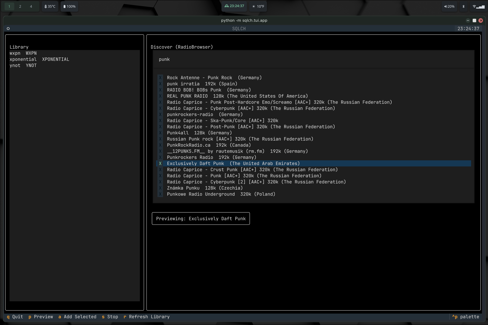
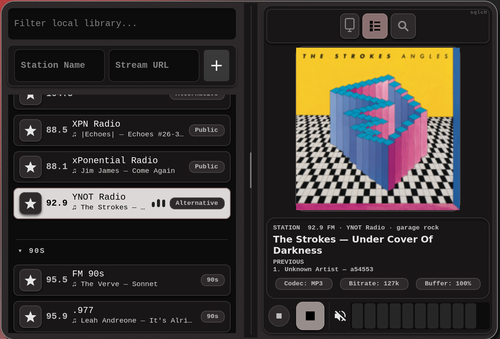

# sqlch

**sqlch** is an internet radio and stream control toolkit built around a
single background daemon, with three interchangeable frontends on top of
it: a **CLI**, a **Textual TUI**, and **sqlch-gui**, a GTK4 Wayland
layer-shell widget. It's designed to sit comfortably in Unix pipelines,
window manager setups, and declarative systems (especially NixOS), while
remaining usable as a standalone Python application.

---

## TUI Preview




---

## What sqlch is

- A **CLI-first** radio orchestrator — status, play, pause, stop, search, preview
- A **daemon + IPC** architecture — a long-running process owns playback state; the CLI, TUI, and GUI all talk to it over a Unix socket
- A **local station library** — stations are saved, tagged, favorited, and tracked with play history
- A **GTK4 desktop widget** (`sqlch-gui`) — a Wayland layer-shell popup with a persistent Now Playing card and a slide-out Library/Discover drawer, themed live from a palette file
- **Stream recording** — bit-perfect capture of the raw stream via mpv, remuxed losslessly (no re-encode) into a tagged file per station
- An **MPRIS2 player** — integrates with desktop environments via D-Bus (playerctl, waybar, etc.)
- A **metadata enricher** — ICY stream titles are enriched via Spotify and MusicBrainz in the background, with cover art fetched for the GUI
- A **Nix-first artifact** — the CLI builds cleanly as a flake package; the GUI ships as a home-manager module

---

## What sqlch is not

- Not a general-purpose music player — it only plays internet radio streams, not local files or Spotify tracks directly
- Not a Spotify client — Spotify is used only as a metadata source, not a playback backend
- Not dependent on global Python state or system packages for the CLI/TUI/daemon

---

## Architecture

```
sqlch/
├── cli/
│   ├── main.py         # Argument parsing and command dispatch
│   └── enrich_cmd.py   # Standalone enrichment entry point (JSON on stdout)
├── core/       # Playback, IPC, library, enrichment, discovery
│   ├── player.py        # mpv lifecycle, IPC helpers, metadata watcher
│   ├── daemon.py        # Unix socket server, command handler
│   ├── client.py        # Client side of daemon IPC
│   ├── library.py       # Station CRUD, play tracking, favorites
│   ├── recorder.py      # Stream recording session + lossless remux
│   ├── mpris_daemon.py  # MPRIS2 D-Bus publisher
│   ├── enrich.py        # MusicBrainz enrichment + cache
│   ├── spoti.py         # Spotify enrichment + cache
│   ├── discover.py      # RadioBrowser search
│   ├── icyprobe.py      # Fetches a station's ICY StreamTitle without starting playback
│   ├── curation_db.py   # SQLite store for heard-track history
│   └── notify.py        # Desktop notifications
└── tui/        # Textual-based interface (optional)

sqlch_gui/      # GTK4 layer-shell desktop widget (separate frontend, same daemon)
├── __main__.py          # Gtk.Application entry point
├── daemon.py            # IPC client (mirrors sqlch.core.client)
├── palette.py           # Loads palette.sh into a color dict for theming
├── metadata.py          # Track metadata + cover art for the Now Playing card
└── ui/
    ├── window.py         # Popup window, layer-shell setup, drag-open drawer
    ├── now_playing.py    # Now Playing card: cover art, controls, volume
    ├── station_list.py   # Library panel: favorites, search, station rows
    ├── discover.py       # RadioBrowser search panel
    ├── controls.py       # Nav buttons, volume meter, record bubble
    ├── banner.py         # Section headers and tag chips
    ├── eq_strip.py       # Playing-state indicator
    └── common.py         # Stylesheet builder (flat CSS from the palette)
```

Key design decisions:

- All MPV communication uses the JSON IPC protocol over a raw Unix socket — no socat, no subprocess pipes
- The MPRIS plugin is optional at runtime; `preview()` works without it
- Enrichment is cached with a 30-day TTL (both Spotify and MusicBrainz)
- Station library is a plain JSON file; plays are recorded with timestamps
- `sqlch_gui` is a separate top-level package, not a subpackage of `sqlch` — it imports `sqlch.core.enrich` directly but keeps its own IPC client and station-list code, since the widget's needs (live probing, favorites, cover art) don't match the CLI's

---

## Installation

### Nix (recommended)

The CLI is packaged as a Nix flake. The Nix build wraps the executable
with isolated dependencies and injects the MPRIS plugin path and mpv
binary — no system Python required.

**Run directly from GitHub (no clone required):**

```bash
nix run github:SW-philip/sqlch
```

**From a local checkout:**

```bash
git clone https://github.com/SW-philip/sqlch
cd sqlch
nix build
./result/bin/sqlch --help
```

**As a flake input:**

```nix
inputs.sqlch.url = "github:SW-philip/sqlch";

environment.systemPackages = [
  inputs.sqlch.packages.x86_64-linux.default
];
```

**GUI, via home-manager:** `flake.nix` also exports
`homeManagerModules.default`, which adds a `sqlch.gui` option:

```nix
sqlch.gui.enable = true;
sqlch.gui.palettePath = "/path/to/palette.sh";  # optional, see below
```

This installs `sqlch-gui` (launch) and `sqlch-gui-toggle` (spawn-or-kill,
meant for a keybind or launcher) plus an XDG desktop entry. It's not part
of `packages.default` — it's a home-manager-only module, since it needs
GTK4, `gtk4-layer-shell`, and PyGObject wired up at the session level
rather than a portable binary.

### Python (development / virtualenv)

```bash
git clone https://github.com/SW-philip/sqlch
cd sqlch
python -m venv .venv
source .venv/bin/activate
pip install -e .
```

Outside of Nix, `SQLCH_MPRIS_PLUGIN` and `MPV_BIN` must be set manually
if MPRIS integration or a non-default mpv binary is needed. Playback and
the CLI work without them. Recording additionally requires `ffmpeg` on
`PATH`.

`pip install -e .` installs the CLI/TUI/daemon only — `sqlch_gui` needs
GTK4, `gtk4-layer-shell`, and PyGObject available to the interpreter
(the Nix home-manager module handles this; a plain virtualenv does not).

---

## Usage

### Daemon

sqlch uses a background daemon for persistent playback state. Start it
once (or manage it with your init system):

```bash
sqlch daemon
```

The CLI talks to the daemon automatically if it's running, and falls
back to direct playback if not.

### Playback

```bash
sqlch play <id|name|index|url>   # play a station by id, name, search index, or URL
sqlch play-last                  # resume the most recently played station
sqlch pause                      # toggle pause
sqlch stop                       # stop playback
sqlch status                     # show current track and station
```

### Recording

```bash
sqlch record            # start a full-stream recording (status if already recording)
sqlch record --track    # start recording, rotating to a new file on each track change
sqlch record stop       # stop and finalize the current recording
```

Recording requires the daemon. mpv dumps the raw stream bytes bit-perfect
to a temp file; on finalize, sqlch remuxes it losslessly with
`ffmpeg -c copy` (no re-encode) into a tagged file under the station's
recordings directory. `--track` mode finalizes and rotates to a new file
on every track change instead of waiting for a manual stop.

### Library

```bash
sqlch list                       # list saved stations
sqlch info <id>                  # show station details
sqlch add <url>                  # add a station by URL
sqlch edit <id>                  # edit station metadata in $EDITOR
sqlch rm <id>                    # remove a station
```

### Discovery

```bash
sqlch search <query>             # search RadioBrowser, shows numbered results
sqlch play <index>               # play result by number from last search
sqlch preview <index|url>        # preview for 10s (ducks main volume if playing)
```

### TUI

```bash
sqlch tui
```

The TUI provides search, selection, preview, and playback backed by the
same core as the CLI.

### GUI

```bash
sqlch-gui           # launch
sqlch-gui-toggle    # launch if not running, otherwise kill (for a keybind)
```

`sqlch-gui` is a small popup anchored to a screen edge via
`gtk4-layer-shell`. The Now Playing card — cover art, station/track info,
codec/bitrate/buffer pills, play/stop, volume, and the record toggle — is
always visible; Library (with a pinned Favorites section) and Discover
live in a drawer that slides out on drag. It drives the same daemon as
the CLI, so playback started from the CLI shows up in the GUI and vice
versa. Station rows in the Library panel periodically probe their ICY
StreamTitle in the background, so a row can show what's currently
playing before you switch to it.

Styling is generated at launch by reading `export NAME="value"` lines
out of a `palette.sh` shell script — see `sqlch_gui/palette.py`'s
`_DEFAULTS` for the full key list and fallback values — rather than
hardcoded colors, so the widget can be re-skinned by pointing
`SQLCH_GUI_PALETTE` at a different file.

---

## MPRIS2 / Desktop Integration

When built with Nix, sqlch registers as `org.mpris.MediaPlayer2.sqlch`
on the session D-Bus:

```bash
playerctl --player=sqlch status
playerctl --player=sqlch metadata
```

Waybar and similar compositors can poll it directly. Volume changes via
D-Bus are forwarded to mpv in real time.

---

## Metadata Enrichment

When a new ICY stream title is detected, sqlch attempts enrichment in
this order:

1. **Spotify** — canonical artist name, album, year, genre, album art
2. **MusicBrainz** — album, year, genre tags (fallback)

Results are cached for 30 days. Set credentials to enable Spotify:

```bash
export SPOTIFY_CLIENT_ID=...
export SPOTIFY_CLIENT_SECRET=...
```

MusicBrainz enrichment requires no credentials.

---

## Environment Variables

| Variable | Default | Purpose |
|---|---|---|
| `MPV_BIN` | `mpv` | Path to mpv binary |
| `SQLCH_MPRIS_PLUGIN` | *(unset)* | Path to MPRIS Lua script (injected by Nix) |
| `SQLCH_GUI_PALETTE` | `~/.config/waybar/palette.sh` | Path to the GUI's theme palette script |
| `SPOTIFY_CLIENT_ID` | *(unset)* | Spotify API client ID |
| `SPOTIFY_CLIENT_SECRET` | *(unset)* | Spotify API client secret |
| `SQLCH_SPOTIFY_BASE` | Spotify API | Override Spotify API base URL |
| `SQLCH_MUSICBRAINZ_BASE` | MusicBrainz API | Override MusicBrainz API base URL |
| `SQLCH_RADIOBROWSER_BASE` | RadioBrowser API | Override RadioBrowser API base URL |
| `XDG_CACHE_HOME` | `~/.cache` | Cache directory root |
| `XDG_DATA_HOME` | `~/.local/share` | Library directory root |
| `XDG_CONFIG_HOME` | `~/.config` | Config directory root |
| `XDG_RUNTIME_DIR` | `/tmp` | Socket directory root |

---

## Notes on development

AI-assisted tools were used throughout development as critical
collaborators — pressure-testing design decisions, interfaces, and
assumptions rather than accelerating output. The emphasis was on
clarity, separation of concerns, and predictable behavior over feature
breadth.
